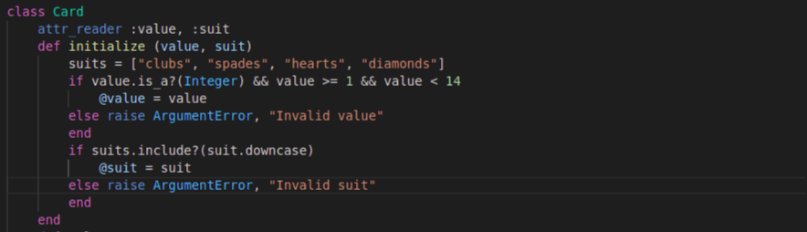
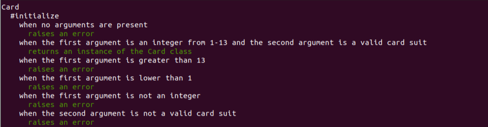
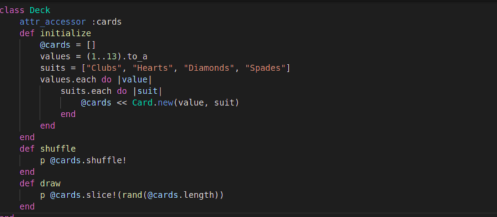
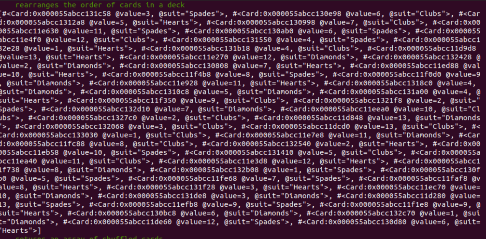
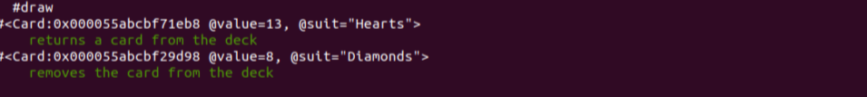

# Deck of Cards
This deck of cards allows a user to create individual cards or a complete deck. It also has the ability to shuffle a deck and draw a random card.

Unit tests were written for this program using the Ruby Spec Suite. All tests, including bonus ones, passed successfully!

A card class was built that only accepts values and suits found on a regular playing card.


A deck class was also built that creates a full 52-card deck.
The deck may be shuffled.


A random card may also be drawn.


Lastly, a play world was created that allows users to interact with all card and deck functions. 
## Installation
This program was written using Ruby version 2.7.1p83.

All that is needed is a terminal with Ruby installed. From the terminal, 
```bash
git clone github.com/gabricca/deck-of-cards
cd deck-of-cards
ruby play.rb
``` 
And enjoy!
## Usage
Follow the prompts to perform various actions or open your preferred code editor and insert the desired code for greater challenge.